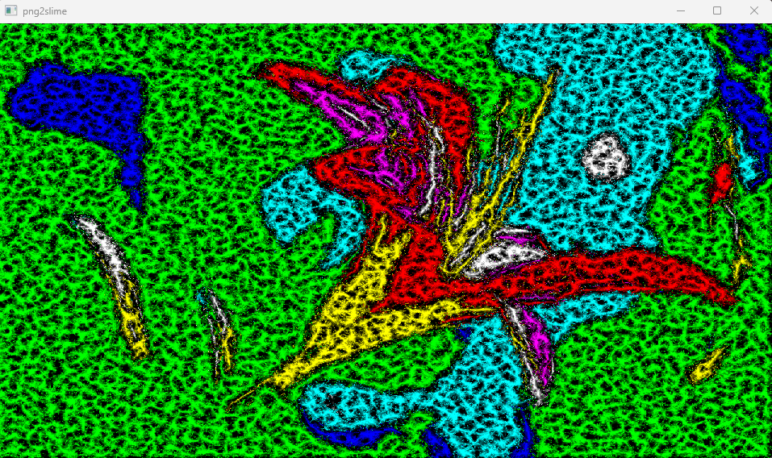
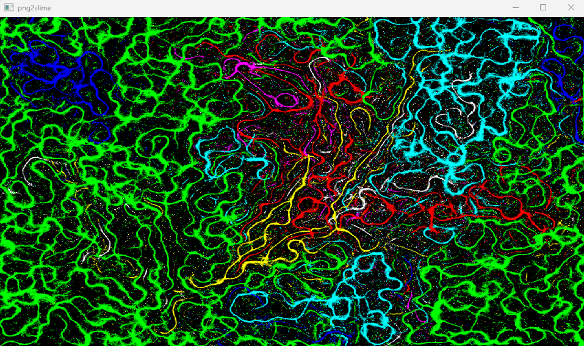

# PNG to Slime Mold (Physarum) Converter

I have no idea why I made this. It's pretty cool though


*Starting image*


*Slime conversion*


*After 10 seconds*

For each pixel in the image, an "agent" is created.
The pixel is mapped to a palette of 7 colors giving 7 different species.
In a compute shader, agents flock towards agents of the same species and away from agents of differing ones.

### Building

#### Windows

Install the [Vulkan SDK](https://www.lunarg.com/vulkan-sdk/) for glslc

```bash
git clone https://github.com/jsoulier/png2slime --recurse-submodules
cd png2slime
mkdir build
cd build
cmake ..
cmake --build . --parallel 8 --config Release
cd bin
./png2slime.exe
```

#### Linux

```bash
sudo apt install glslc
```

```bash
git clone https://github.com/jsoulier/png2slime --recurse-submodules
cd png2slime
mkdir build
cd build
cmake .. -DCMAKE_BUILD_TYPE=Release
cmake --build . --parallel 8
cd bin
./png2slime
```

### Usage

Drag files from e.g. your file explorer onto the application.

### References

- [Article](https://cargocollective.com/sagejenson/physarum) by Sage Jensen
- [Youtube Video](https://youtu.be/X-iSQQgOd1A?si=cVJn3vHjYJANm0gD) by Sebastian Lague